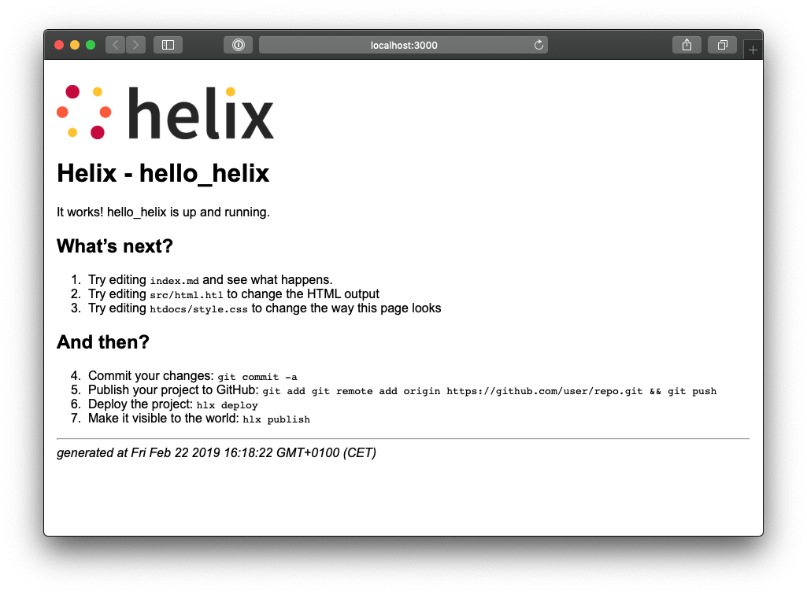
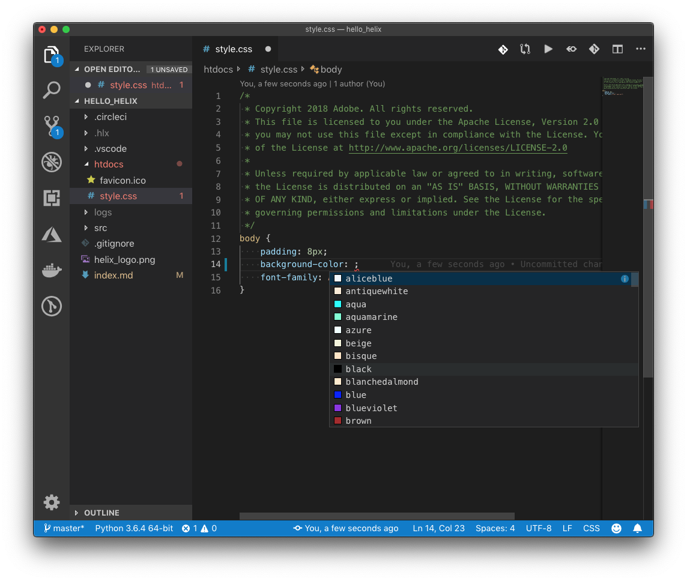
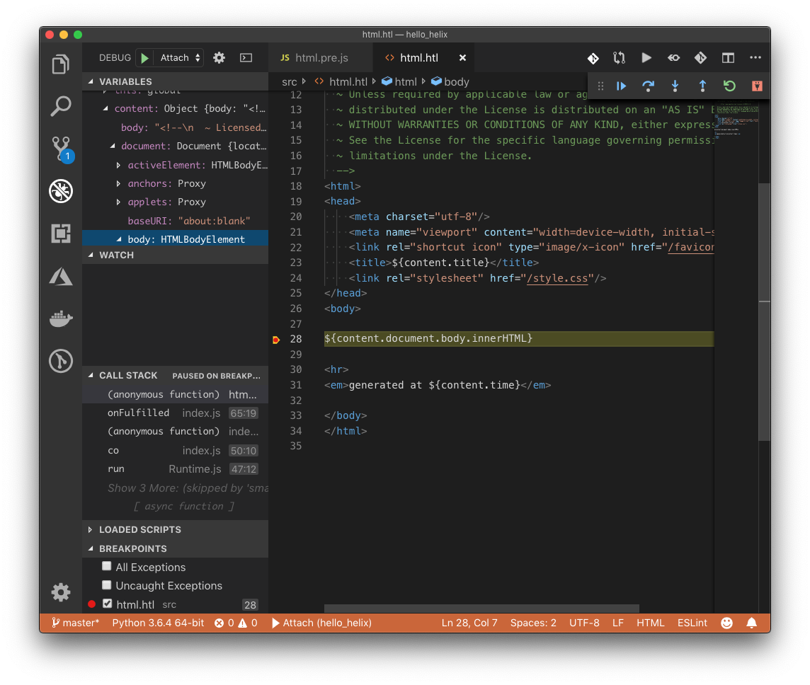

<!--
/*
* Copyright 2018 Adobe. All rights reserved.
* This file is licensed to you under the Apache License, Version 2.0 (the "License");
* you may not use this file except in compliance with the License. You may obtain a copy
* of the License at http://www.apache.org/licenses/LICENSE-2.0
*
* Unless required by applicable law or agreed to in writing, software distributed under
* the License is distributed on an "AS IS" BASIS, WITHOUT WARRANTIES OR REPRESENTATIONS
* OF ANY KIND, either express or implied. See the License for the specific language
* governing permissions and limitations under the License.
*/
-->

# Welcome to Project Helix

Helix is the new experience management service to create, manage, and deliver great digital experiences.

Better than a long story, just try it!

## Start Developing Your First Helix Project in 60 Seconds

### Pre-Requisites

1. [Git](https://git-scm.com/) should be [installed](https://git-scm.com/book/en/v2/Getting-Started-Installing-Git) and [setup](https://git-scm.com/book/en/v2/Getting-Started-First-Time-Git-Setup) on your machine.
2. For the sake of this short walkthrough we assume you are using [Visual Studio Code](https://code.visualstudio.com), our IDE of choice. However, any other JavaScript IDE would do as well.

### Let's Get Started

#### 1. Install `hlx`, the Helix Command Line Tool

```bash
curl -sL https://www.project-helix.io/cli.sh | sh
```

#### 2. Create Your First Helix Project

```bash
# our new project will be called 'hello_helix'
hlx demo hello_helix
```

#### 3. Open the project in Visual Studio Code

```bash
cd hello_helix
code .
```

#### 4. Launch the Local Helix Development Environment

```bash
hlx up
```

A browser window opens, rendering the project's generated web page.



#### 5. Edit some content

In the IDE, navigate to `index.md` in the left pane and double-click to open it. Edit the document and save the changes.


Refresh the browser and see the result.


#### 6. Edit style sheet

In the IDE, navigate to `htdocs/style.css` in the left pane and double-click to open it. Change e.g. the background color and save the changes.



Refresh the browser and see the result.

#### 7. Start Debugging

##### Set a Breakpoint in your JavaScript code

In the IDE, navigate to `src/html.pre.js` in the left pane and double-click to open it. Set a breakpoint in the body of the `pre` function, switch to the Debug view and click on the green arrow in the toolbar.


##### Trigger the Breakpoint

Refresh the Browser, the Debugger will pause at the breakpoint. Take a look at the `payload` object in the Variables pane.


Click **Continue (F5)** to resume execution. Try changing the code, save the changes and see the results in the browser.

#### 8. Now Debug your HTL

In the IDE, navigate to `src/html.htl` in the left pane and double-click to open it. Set a breakpoint on a line containing a `${...}` variable reference. Refresh the Browser, the Debugger will pause at the breakpoint.



Congratulations! You've just got your hands dirty on your first Helix Project!
